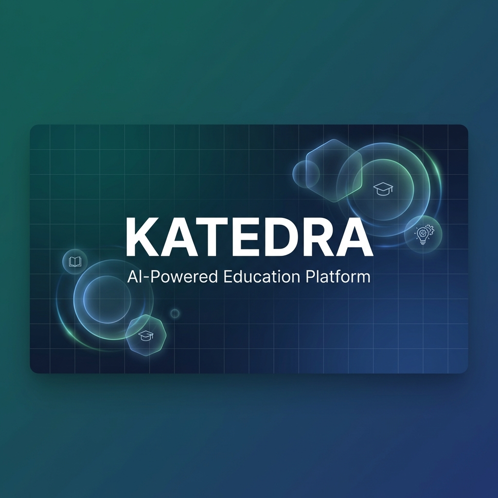
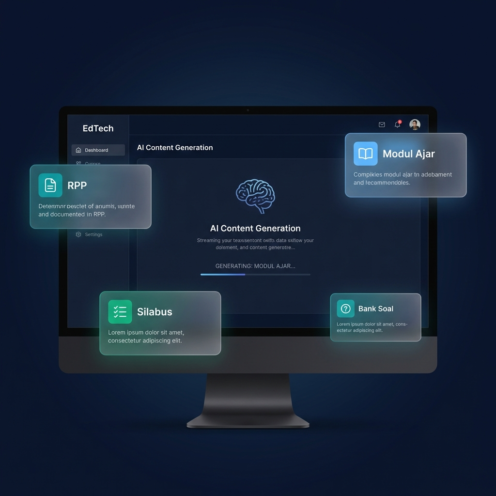
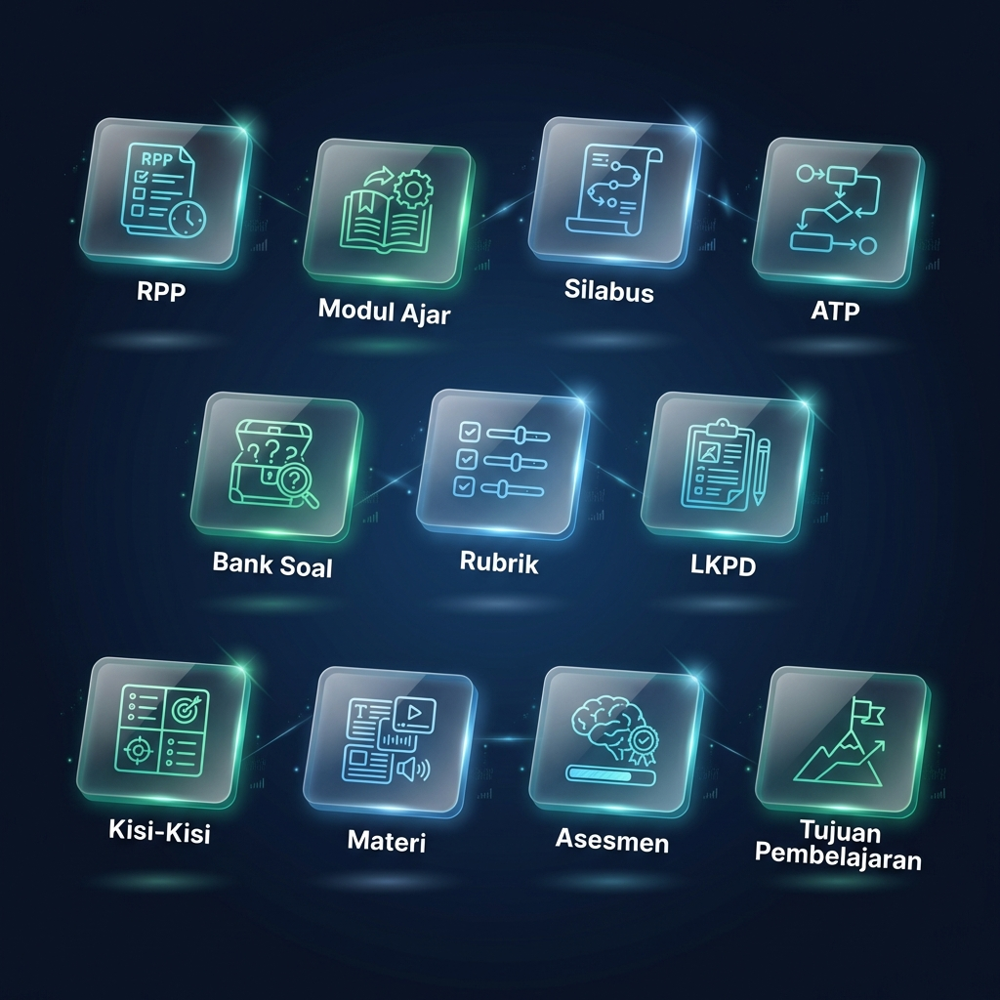
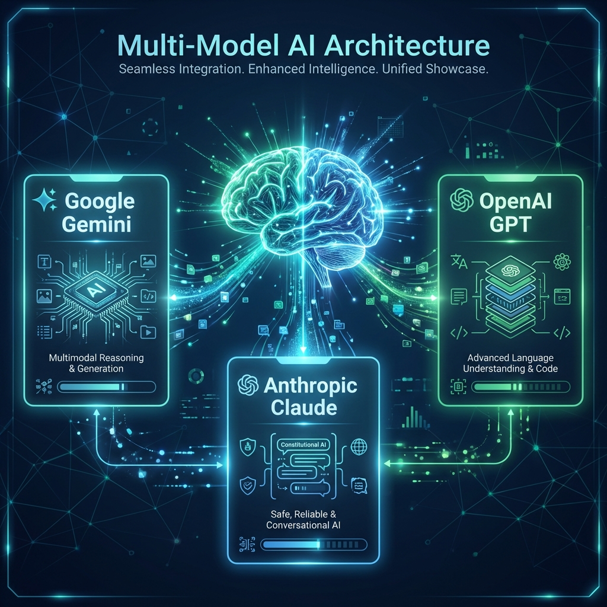
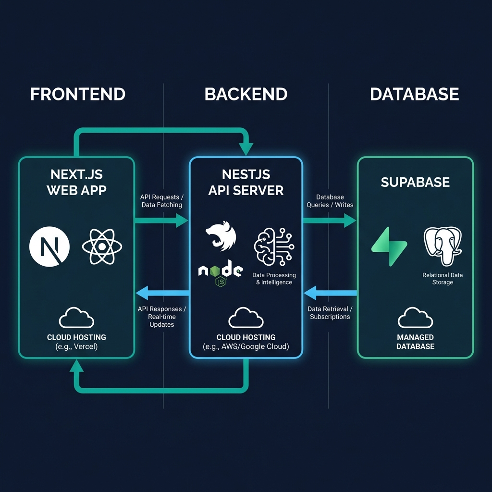
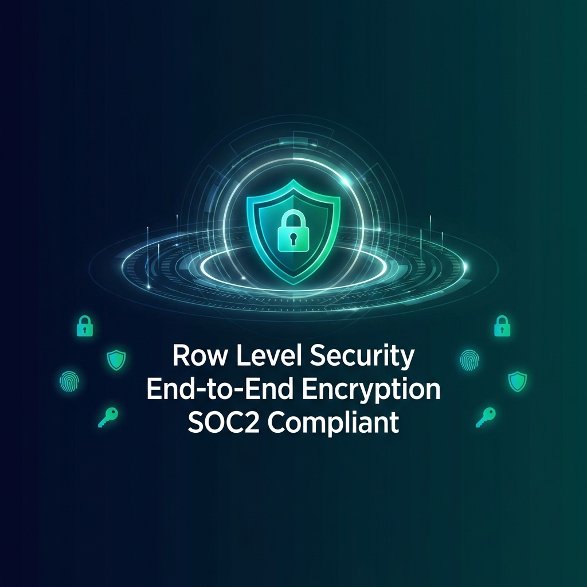

<p align="center">
  
</p>

<h1 align="center">Katedra AI</h1>
<h3 align="center">Enterprise-Grade AI Platform for Indonesian Educators</h3>
<p align="center"><strong>Administrasi Selesai, Inspirasi Dimulai.</strong></p>

<p align="center">
  <a href="#quick-start">Quick Start</a> •
  <a href="#features">Features</a> •
  <a href="#architecture">Architecture</a> •
  <a href="#api-reference">API Reference</a> •
  <a href="#documentation">Docs</a> •
  <a href="#contributing">Contributing</a>
</p>

<p align="center">
  
  
  
  
  
</p>

<p align="center">
  
  
  
  
  
</p>

---

## 📋 Table of Contents

- [About Katedra](#about-katedra)
- [Features](#features)
- [Document Modules](#document-modules)
- [AI Architecture](#ai-architecture)
- [System Architecture](#system-architecture)
- [Quick Start](#quick-start)
- [Technology Stack](#technology-stack)
- [Security](#security)
- [API Reference](#api-reference)
- [Contributing](#contributing)
- [License](#license)

---

## About Katedra

<p align="center">
  
</p>

**Katedra AI** is an enterprise-grade Educational Technology (EdTech) platform specifically designed for Indonesian educators. Built on modern cloud-native architecture, Katedra leverages cutting-edge AI models to automate up to **90% of administrative tasks** while maintaining full compliance with **Kurikulum Merdeka 2024** standards.

### The Problem We Solve

Indonesian teachers spend an average of **15-20 hours per week** on administrative tasks:
- Creating lesson plans (RPP, Modul Ajar)
- Developing assessments and rubrics
- Preparing teaching materials
- Writing progress reports

**Katedra reduces this to under 2 hours** while ensuring regulatory compliance and pedagogical quality.

### Key Statistics

| Metric | Value | Description |
|--------|-------|-------------|
| **Documents Generated** | 50,000+ | Active platform usage |
| **Time Saved** | 90% | Reduction in admin tasks |
| **Accuracy Rate** | 99.2% | Curriculum compliance |
| **Active Users** | 2,500+ | Teachers across Indonesia |
| **Uptime** | 99.9% | Service availability |

---

## Features

<table>
<tr>
<td width="25%" align="center">
<h3>⚡</h3>
<h4>Lightning Fast</h4>
<p>Generate 20-page documents in under 30 seconds</p>
</td>
<td width="25%" align="center">
<h3>🎯</h3>
<h4>Curriculum Aligned</h4>
<p>100% compliant with Kurikulum Merdeka regulations</p>
</td>
<td width="25%" align="center">
<h3>🧠</h3>
<h4>AI-Powered</h4>
<p>Multi-model AI (Gemini, GPT-4, Claude)</p>
</td>
<td width="25%" align="center">
<h3>🔒</h3>
<h4>Enterprise Security</h4>
<p>SOC2-compliant with encryption</p>
</td>
</tr>
</table>

---

## Document Modules

<p align="center">
  
</p>

Katedra provides **11 specialized AI modules** for educational document generation:

### Core Planning Documents

| Module | Description | Features |
|--------|-------------|----------|
| **📋 RPP** | Rencana Pelaksanaan Pembelajaran | Kompetensi, Tujuan, Langkah Pembelajaran |
| **📚 Modul Ajar** | Comprehensive teaching module | Profil Pelajar Pancasila, Asesmen Diagnostik |
| **📅 Silabus** | Semester-based syllabus | Alokasi Waktu, Materi Esensial |
| **🎯 ATP** | Alur Tujuan Pembelajaran | Phase-based objectives, Competency mapping |

### Assessment & Materials

| Module | Description | Features |
|--------|-------------|----------|
| **✅ Asesmen** | Formatif & Sumatif assessments | Rubrik included |
| **📝 Bank Soal** | Question bank generator | PG, Essay, HOTS classification |
| **📊 Kisi-Kisi** | Test blueprints | UH, PTS, PAS, PAT |
| **📐 Rubrik** | Assessment rubrics | Skala 1-4, 1-100, A-E |
| **📑 LKPD** | Student worksheets | Activity-based learning |
| **📖 Materi** | Teaching materials | Text, Presentation, Video |
| **🏆 Tujuan Pembelajaran** | Learning objectives | Bloom's Taxonomy aligned |

---

## AI Architecture

<p align="center">
  
</p>

Katedra employs a sophisticated multi-model AI architecture:

### Available Models

| Model | Provider | Speed | Quality | Best For |
|-------|----------|-------|---------|----------|
| `gemini-2.5-flash` | Google | ⚡⚡⚡ | ★★★★☆ | Default choice |
| `gemini-1.5-pro` | Google | ⚡⚡ | ★★★★★ | Complex documents |
| `gpt-4o` | OpenAI | ⚡⚡ | ★★★★★ | Complex reasoning |
| `claude-3.5-sonnet` | Anthropic | ⚡⚡ | ★★★★★ | Creative content |

### Context-Aware Generation

Our AI understands Indonesian educational context:

```typescript
const educationalContext = {
  curriculum: "Kurikulum Merdeka 2024",
  regulations: [
    "Permendikbudristek No. 12/2024",
    "Keputusan BSKAP No. 032/H/KR/2024"
  ],
  frameworks: [
    "Taksonomi Bloom (Revised)",
    "Understanding by Design (UbD)",
    "Profil Pelajar Pancasila"
  ]
};
```

---

## System Architecture

<p align="center">
  
</p>

### High-Level Overview

```
┌─────────────────┐     ┌─────────────────┐     ┌─────────────────┐
│    Frontend     │────▶│    Backend      │────▶│    Database     │
│   Next.js 16    │     │   NestJS 10     │     │   Supabase      │
│   React 19      │◀────│   AI Services   │◀────│   PostgreSQL    │
└─────────────────┘     └─────────────────┘     └─────────────────┘
                               │
                    ┌──────────┼──────────┐
                    ▼          ▼          ▼
              ┌──────────┐ ┌──────────┐ ┌──────────┐
              │ Gemini   │ │ OpenAI   │ │ Claude   │
              │ API      │ │ API      │ │ API      │
              └──────────┘ └──────────┘ └──────────┘
```

### Technology Stack

**Frontend:**
- Next.js 16.1 (App Router)
- React 19.2 (with Compiler)
- TypeScript 5.x
- Tailwind CSS 4.x
- Framer Motion

**Backend:**
- NestJS 10.x
- PostgreSQL (Supabase)
- Redis (Caching)

---

## Security

<p align="center">
  
</p>

### Security Layers

| Layer | Technology | Protection |
|-------|------------|------------|
| **Network** | Cloudflare | DDoS, WAF, Rate Limiting |
| **Transport** | TLS 1.3 | HTTPS, HSTS |
| **Application** | JWT + Zod | Auth, Input Validation |
| **Database** | RLS | Row Level Security |

### Data Protection

- ✅ End-to-end encryption (AES-256)
- ✅ Row Level Security (RLS) on all tables
- ✅ GDPR/Privacy compliant
- ✅ No AI training on user data

---

## Quick Start

```bash
# 1. Clone the repository
git clone https://github.com/katedra-ai/katedra.git
cd katedra

# 2. Install dependencies
npm install

# 3. Configure environment
cp .env.example .env.local
# Edit .env.local with your Supabase credentials

# 4. Start development
npm run dev

# 5. Open http://localhost:3000
```

### Environment Variables

```env
NEXT_PUBLIC_APP_URL=http://localhost:3000
NEXT_PUBLIC_API_URL=http://localhost:3001
NEXT_PUBLIC_SUPABASE_URL=https://your-project.supabase.co
NEXT_PUBLIC_SUPABASE_ANON_KEY=your-anon-key
```

---

## Project Structure

```
katedra/
├── 📁 app/                    # Next.js App Router
│   ├── (auth)/                # Login, Register
│   └── (dashboard)/           # Main Application
│       └── dashboard/
│           ├── rpp/           # RPP Module
│           ├── modul-ajar/    # Modul Ajar
│           ├── silabus/       # Silabus
│           ├── atp/           # ATP
│           ├── asesmen/       # Asesmen
│           ├── bank-soal/     # Bank Soal
│           ├── rubrik/        # Rubrik
│           ├── kisi-kisi/     # Kisi-Kisi
│           ├── lkpd/          # LKPD
│           ├── materi/        # Materi
│           └── tujuan-pembelajaran/
├── 📁 components/             # React Components
│   ├── ui/                    # 28 UI Primitives
│   └── dashboard/             # Dashboard Components
├── 📁 hooks/                  # 22 Custom Hooks
├── 📁 lib/                    # Utilities
└── 📁 public/                 # Static Assets
```

---

## API Reference

### Base URL

```
Production: https://orenax-production-0c1a.up.railway.app
Development: http://localhost:3001
```

### Document Generation (Streaming)

| Endpoint | Method | Description |
|----------|--------|-------------|
| `/api/v2/rpp/stream` | POST | Generate RPP |
| `/api/v2/modul-ajar/stream` | POST | Generate Modul Ajar |
| `/api/v2/silabus/stream` | POST | Generate Silabus |
| `/api/v2/atp/stream` | POST | Generate ATP |
| `/api/v2/asesmen/stream` | POST | Generate Asesmen |
| `/api/v2/bank-soal/stream` | POST | Generate Bank Soal |
| `/api/v2/rubrik/stream` | POST | Generate Rubrik |
| `/api/v2/kisi-kisi/stream` | POST | Generate Kisi-Kisi |
| `/api/v2/lkpd/stream` | POST | Generate LKPD |
| `/api/v2/materi/stream` | POST | Generate Materi |
| `/api/v2/tujuan-pembelajaran/stream` | POST | Generate TP |

### Example Request

```javascript
const response = await fetch('/api/v2/rpp/stream', {
  method: 'POST',
  headers: {
    'Content-Type': 'application/json',
    'Authorization': `Bearer ${token}`
  },
  body: JSON.stringify({
    mapel: 'Matematika',
    topik: 'Persamaan Kuadrat',
    kelas: '10',
    model: 'gemini-2.5-flash'
  })
});

// Handle streaming response
const reader = response.body.getReader();
```

---

## Custom Hooks

Katedra provides **22 custom React hooks**:

### Document Generation

```typescript
import { useRPP, useModulAjar, useSilabus } from '@/hooks';

function MyComponent() {
  const { generateWithStreaming, streaming } = useRPP();
  
  return (
    <div>
      <button onClick={() => generateWithStreaming(params)}>
        Generate RPP
      </button>
      <div>{streaming.content}</div>
    </div>
  );
}
```

### Available Hooks

| Hook | Purpose |
|------|---------|
| `useAuth` | Authentication management |
| `useRPP` | RPP generation |
| `useModulAjar` | Modul Ajar generation |
| `useSilabus` | Silabus generation |
| `useATP` | ATP generation |
| `useAsesmen` | Asesmen generation |
| `useBankSoal` | Bank Soal generation |
| `useRubrik` | Rubrik generation |
| `useKisiKisi` | Kisi-Kisi generation |
| `useLKPD` | LKPD generation |
| `useMateri` | Materi generation |
| `useTujuanPembelajaran` | TP generation |
| `useLocalSettings` | Local storage settings |
| `useResource` | Generic CRUD |
| `useProfile` | User profile |

---

## Export System

Katedra uses **client-side document generation**:

### DocumentExportPanel Component

```tsx
<DocumentExportPanel
  content={streaming.content}
  title="RPP Matematika"
  documentType="rpp"
  contentRef={contentRef}
/>
```

### Export Features

| Format | Features |
|--------|----------|
| **PDF** | jsPDF + html2canvas, Headers/Footers |
| **DOCX** | docx library, Formatted content |
| **Copy** | Clipboard API |
| **Print** | Native browser print |

---

## Deployment

### Vercel (Frontend)

```bash
vercel --prod
```

### Railway (Backend)

```bash
railway up
```

### Docker

```yaml
version: '3.8'
services:
  frontend:
    build: ./katedra
    ports: ["3000:3000"]
    
  backend:
    build: ./Bagian_Belakang
    ports: ["3001:3001"]
```

---

## Contributing

We welcome contributions! Here's how:

1. Fork the repository
2. Create feature branch (`git checkout -b feature/amazing`)
3. Commit changes (`git commit -m 'feat: add amazing feature'`)
4. Push branch (`git push origin feature/amazing`)
5. Open Pull Request

### Commit Convention

```
feat: New feature
fix: Bug fix
docs: Documentation
style: Formatting
refactor: Code refactoring
test: Adding tests
```

---

## Changelog

### v1.0.0 (2026-01-12)

- ✨ 11 document generation modules
- ✨ Client-side PDF/DOCX export
- ✨ Multi-model AI (Gemini, GPT-4, Claude)
- ✨ Google OAuth authentication
- ✨ Dark/Light mode
- 🔒 Row Level Security
- 📱 Responsive design

---

## License

```
MIT License
Copyright (c) 2026 Katedra AI
```

---

<p align="center">
  <strong>Made with ❤️ for Indonesian Educators</strong>
</p>

<p align="center">
  <em>"Pendidikan adalah senjata paling mematikan di dunia, karena dengan pendidikan, Anda dapat mengubah dunia."</em><br>
  — Nelson Mandela
</p>

<p align="center">
  
  
  
</p>

<p align="center">
  <a href="#katedra-ai">⬆️ Back to Top</a>
</p>
